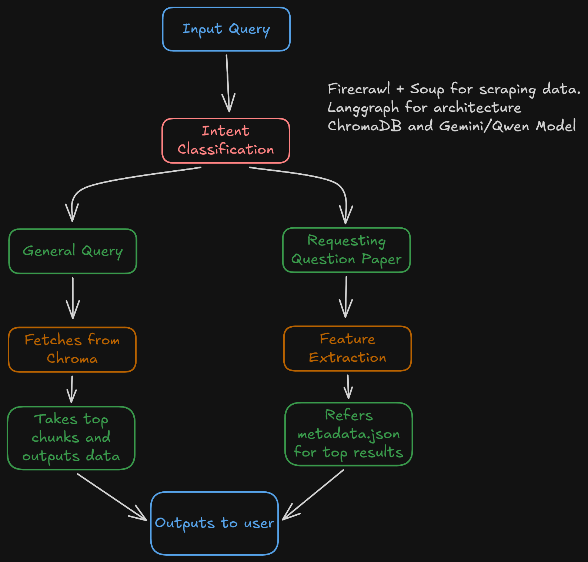

## Voice based assistant for IGNOU

This project is part of my Spider-ML onsites, built in a day. I found the hardest part to be picking up langgraph, and scraping data from the "uniquely" designed website.

### Ingested Data:
- About Page:
    - Amenities
    - Authorities
    - Awards
    - Etc. (Availble in the `data/markdown` directory)
- Employee Services:
    - Announcements
    - List of Hospitals
    - Guest House staff
    - A few available jobs
    - Etc.
- Student Services:
    - Academic Calander
    - Anti Ragging
    - Faqs
    - Swayam Prabha
    - Etc.
- Question Papers:
    - ~950 papers with metadata having their:
        - Course Code
        - Course Name
        - Exam Type
        - Session